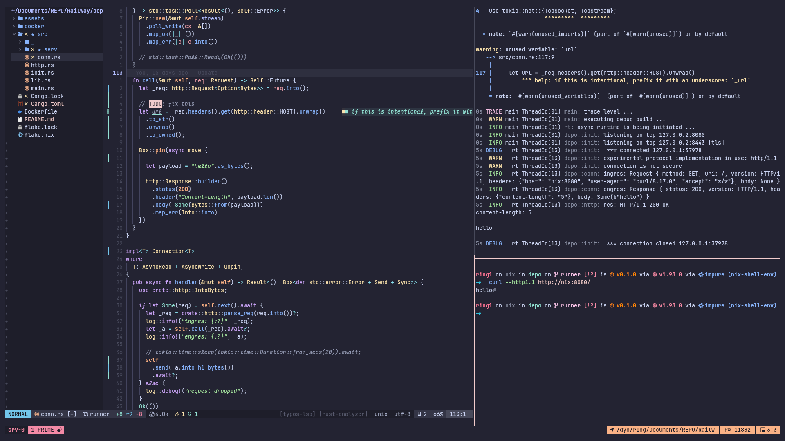
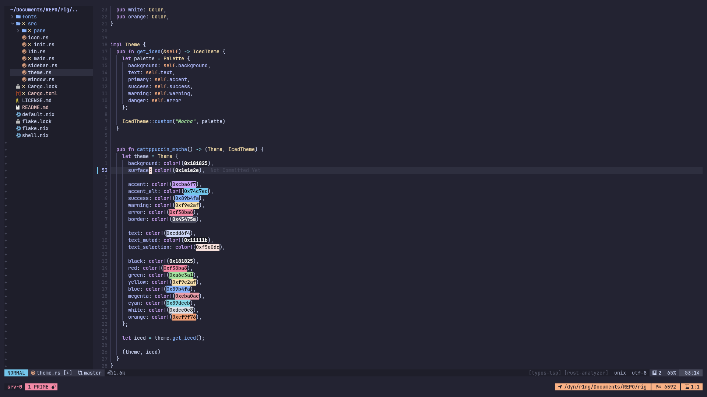
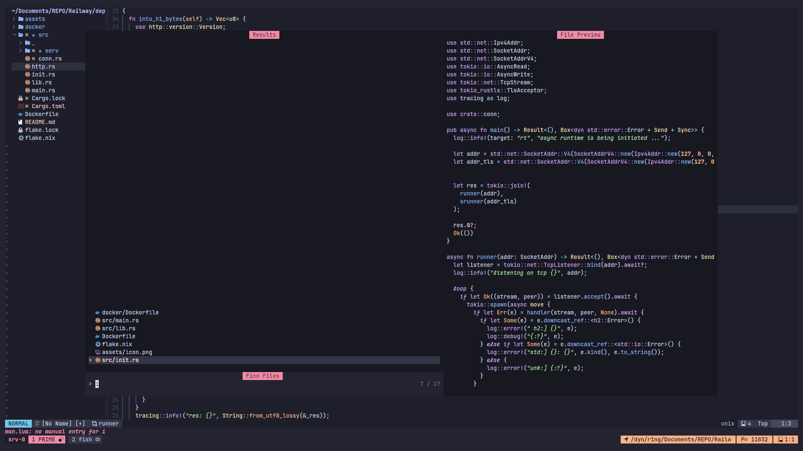
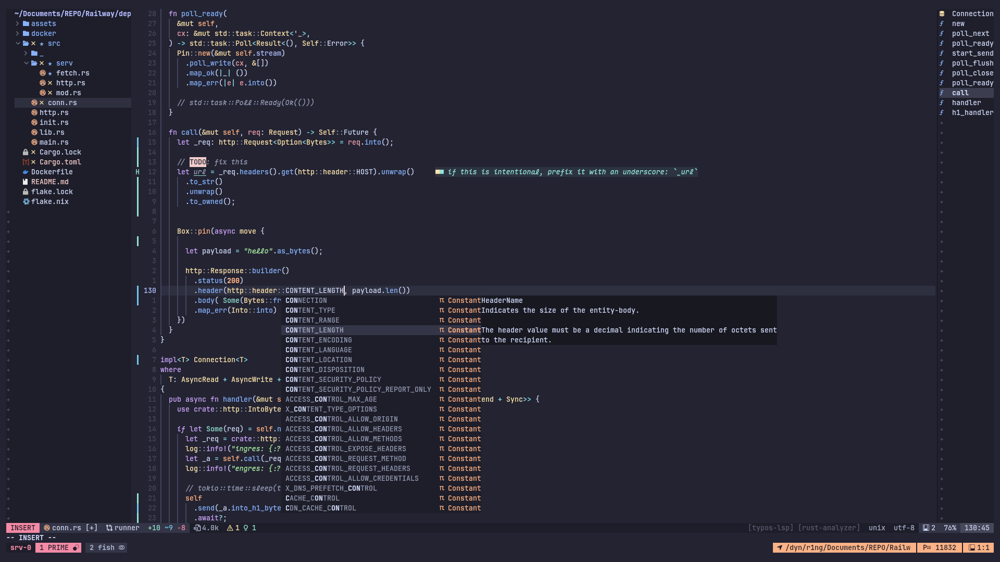

# Neovim Config

## Features

  - [x] Telescope file picker with fzf.
  - [x] 500 undo/redo, tabsize is 2.
  - [x] Preserve last cursor position.
  - [x] Treesitter - Rich syntex highlighting.
  - [x] Ripgrep as default vimgrep.
  - [x] Native neovim-lsp configuration.
  - [x] Typo checker & suggest (via typos-lsp).
  - [x] Buffer word completion, lua snip, lsp actions, nvim's buildin code formatter.
  - [x] Llama-server - model of your choice (not enabled by default).
  - [x] Code outline, file explorer.
  - [x] Fully disabled mouse control or keyboard only editor.
  - [x] Lualine.
  - [x] Stealth design with single colorscheme.

## Screenshots

